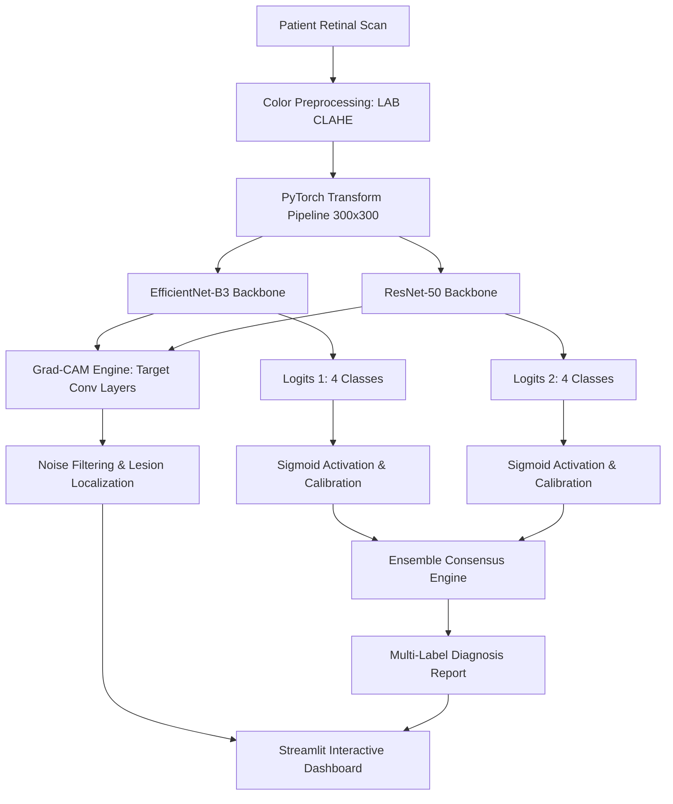

# 📖 Complete Technical & Clinical Project Guide
## Retinal AI: Dual-Model Lesion Detector & Explainability Hub

---

## 📑 Table of Contents
1. [Executive Summary & 30-Second Elevator Pitch](#1-executive-summary--30-second-elevator-pitch)
2. [Clinical Background & Medical Fundamentals](#2-clinical-background--medical-fundamentals)
3. [System Architecture & Core Methodologies](#3-system-architecture--core-methodologies)
4. [Mathematical & Algorithmic Deep Dive](#4-mathematical--algorithmic-deep-dive)
5. [File-by-File Technical Code Walkthrough](#5-file-by-file-technical-code-walkthrough)
6. [Evaluation Metrics & Performance Analysis](#6-evaluation-metrics--performance-analysis)
7. [Comprehensive Interview & Viva Q&A Guide](#7-comprehensive-interview--viva-qa-guide)
8. [Resume & LinkedIn Presentation Masterclass](#8-resume--linkedin-presentation-masterclass)

---

## 1. Executive Summary & 30-Second Elevator Pitch

### 💡 The 30-Second Elevator Pitch
> *"I built a clinical-grade Computer Vision screening system for **Multi-Label Retinal Disease Detection** using PyTorch and Streamlit. The system combines **EfficientNet-B3** for fine microvascular lesion detection with **ResNet-50** for global optic disc structural analysis into an ensemble consensus engine. To address medical 'black-box' opacity, I implemented **Grad-CAM (Gradient-Weighted Class Activation Mapping)** with zero-activation noise suppression to localize lesion hotspots in real time, and utilized **Full-Color CLAHE in LAB color space** to boost vessel contrast without altering diagnostic pigment."*

### 🎯 Core Problem Statement
* Over **2.2 billion people** globally live with vision impairment, of which at least **1 billion cases** were preventable or unaddressed (WHO).
* Diabetic Retinopathy, Glaucoma, Cataract, and Age-Related Macular Degeneration (AMD) represent the leading causes of irreversible adult blindness.
* Routine fundus photography is fast and non-invasive, but manual grading suffers from an extreme scarcity of certified ophthalmologists and high inter-observer variability.
* **Our Solution:** An automated, explainable, dual-backbone AI screener that flags co-occurring pathologies simultaneously with visual evidence heatmaps.

---

## 2. Clinical Background & Medical Fundamentals

Retinal fundus photography captures the interior back surface of the eye (the retina), including the optic disc, macula, and blood vessels.

```
       ┌─────────────────────────────────────────────────────┐
       │                 FUNDUS ANATOMY MAP                  │
       │                                                     │
       │     Nasal Side                      Temporal Side   │
       │    (Towards Nose)                  (Towards Temple) │
       │                                                     │
       │       [Optic Disc]                  (  Macula  )    │
       │       (Emergence of                 (Sharp central  │
       │        nerve & vessels)              vision: Fovea) │
       │                                                     │
       └─────────────────────────────────────────────────────┘
```

### The 4 Target Pathologies

| Pathology | Anatomical Target | Visible Clinical Lesions | Why Early Detection Matters |
| :--- | :--- | :--- | :--- |
| **Diabetic Retinopathy (DR)** | Retinal microvasculature & periphery | **Microaneurysms** (tiny red dots), **blot hemorrhages**, **hard exudates** (yellow waxy lipid deposits), cotton wool spots. | Chronic high blood sugar damages capillary walls, leading to leakage, retinal detachment, and total blindness. |
| **Glaucoma** | Optic Nerve Head / Optic Disc | Increased **Cup-to-Disc Ratio (CDR > 0.6)**, neuroretinal rim notch thinning, peripapillary atrophy. | High intraocular pressure compresses the optic nerve, destroying peripheral vision ("tunnel vision") irreversibly. |
| **Cataract** | Crystalline Lens (reflected through fundus view) | **Media opacity**, generalized optical blurring, yellowish haze obscuring vessel sharpness. | World's leading cause of blindness; reversible through timely lens replacement surgery. |
| **AMD (Macular Degeneration)** | Macula lutea (central retina) | **Drusen** (yellow sub-retinal extracellular waste deposits), pigmentary changes, subretinal fluid in wet AMD. | Destroys sharp, central vision required for reading, driving, and face recognition. |

---

## 3. System Architecture & Core Methodologies



### Why a Dual-Model Ensemble?
Single deep-learning models often develop architectural biases:
1. **EfficientNet-B3 (Compound Scaling)**:
   * Uses mobile inverted bottleneck convolutions (**MBConv**) with squeeze-and-excitation blocks.
   * Efficient depth, width, and resolution scaling makes it exceptionally sensitive to **high-frequency, localized pixel variations** (small microaneurysms, fine lipid exudates).
2. **ResNet-50 (Residual Connections)**:
   * Uses identity skip connections ($x + \mathcal{F}(x)$) across deep stages.
   * Captures **macro-structural geometry**, such as the global optic disc cup boundary, large vessel bifurcation patterns, and overall lens obscuration.
3. **Consensus Strategy**:
   * Predictions are combined via soft-voting: $P_{\text{ensemble}} = \frac{P_{\text{eff}} + P_{\text{res}}}{2}$.
   * When both models agree ($|P_{\text{eff}} - P_{\text{res}}| < 0.15$), clinical confidence is high.
   * When models conflict, the dashboard flags the discrepancy for manual ophthalmological review.

---

## 4. Mathematical & Algorithmic Deep Dive

### A. Contrast-Limited Adaptive Histogram Equalization (CLAHE) in LAB Space
Standard histogram equalization in RGB space modifies the R, G, and B channels independently, causing unnatural color shifts (e.g., turning pink retinas bright orange or purple).
* We convert RGB to **CIE LAB color space**:
  * **$L^*$**: Luminance (lightness channel, 0–100).
  * **$a^*$**: Green-to-Red opponent channel.
  * **$b^*$**: Blue-to-Yellow opponent channel.
* CLAHE is applied **only to the $L^*$ channel**:
  $$\text{Clip Limit} = 3.0, \quad \text{Grid Size} = 8 \times 8$$
* This redistributes local contrast across small tiles, highlighting tiny microaneurysms and deep cupping without disturbing biological retinal pigment.

### B. Multi-Label Classification Mathematics
Because an eye can exhibit **both Diabetic Retinopathy and Glaucoma simultaneously**, the classification task is **Multi-Label**, not Multi-Class.
* **Why NOT Softmax?** Softmax enforces $\sum_{c=1}^C P_c = 1$, assuming mutually exclusive classes.
* **Sigmoid Activation**: Each class $c \in \{1, 2, 3, 4\}$ is evaluated independently:
  $$\sigma(z_c) = \frac{1}{1 + e^{-z_c}}$$
* **Loss Function**: Binary Cross-Entropy with Logits (`nn.BCEWithLogitsLoss`):
  $$\mathcal{L} = -\frac{1}{C} \sum_{c=1}^C \left[ y_c \log \sigma(z_c) + (1 - y_c) \log(1 - \sigma(z_c)) \right]$$

### C. Grad-CAM (Gradient-Weighted Class Activation Mapping)
Grad-CAM calculates the gradient of the target class score $y^c$ with respect to the feature map activations $A^k$ of the final convolutional layer.

1. **Neuron Importance Weight $\alpha_k^c$**:
   $$\alpha_k^c = \frac{1}{Z} \sum_{i} \sum_{j} \frac{\partial y^c}{\partial A_{i, j}^k}$$
   *(Global Average Pooling of gradients across spatial dimensions $i, j$)*

2. **Weighted Linear Combination & ReLU**:
   $$L_{\text{Grad-CAM}}^c = \text{ReLU}\left( \sum_k \alpha_k^c A^k \right)$$
   *The $\text{ReLU}$ ensures we only visualize features that have a **positive influence** on the target disease, ignoring features that contribute to other categories.*

3. **Bilinear Upsampling & Noise Filtering**:
   * Upsampled to image resolution ($300 \times 300$).
   * Smoothed via Gaussian Blur ($\sigma = 11$).
   * Zero-suppression threshold: all activations $< 0.20$ are zeroed out to eliminate background optic nerve or border artifacts.

---

## 5. File-by-File Technical Code Walkthrough

### 1. `app.py` (Streamlit Dashboard & Inference Engine)
* **`RetinalScreener` class**: Wraps EfficientNet-B3 and ResNet-50 with custom 4-output linear projection heads and dropout.
* **`load_models()` with `@st.cache_resource`**: Keeps model instances in RAM across browser refreshes for millisecond-speed inference.
* **Fallback Mode Detection**: Automatically alerts the user if local weights are not detected, seamlessly falling back to demonstration mode.
* **`get_gc_map()`**: Registers forward and backward hooks inside a `try ... finally` block, preventing memory leaks.
* **`mark_lesion()`**: Protected against zero-activation errors using threshold checks.

### 2. `train.py` (PyTorch Multi-Label Training Pipeline)
* **`RetinalDataset`**: Custom PyTorch dataset integrating dynamic LAB CLAHE preprocessing and PIL transformations.
* **Data Augmentations**: Random horizontal/vertical flips, rotations ($\pm 15^\circ$), and color jitter to prevent overfitting on limited fundus datasets.
* **Optimization Setup**: AdamW optimizer ($\text{lr} = 10^{-4}$, $\text{weight decay} = 10^{-2}$) coupled with `CosineAnnealingLR` scheduler.
* **`evaluate()`**: Computes Macro-F1, Micro-F1, and Subset Accuracy across validation mini-batches.

### 3. `Retinal_AI_Final.ipynb` (Research & Validation Notebook)
* Notebook for research validation and generating publishable figures.
* Contains the multi-label diagnostic performance matrix and visual demonstration code.

### 4. `sample_images/` (Standardized Evaluation Data)
* Includes two clinical-standard fundus scans for zero-setup evaluation:
  1. `sample_1_diabetic_retinopathy.jpg`: Exhibits microaneurysms and hemorrhages.
  2. `sample_2_healthy_retina.jpg`: Clear optic disc, intact macula, normal vasculature.

---

## 6. Evaluation Metrics & Performance Analysis

### Why Standard Accuracy Fails in Medical AI
In a dataset where only 5% of patients have Glaucoma, a naive model that predicts "Healthy" 100% of the time achieves **95% accuracy** while missing **100% of blind patients**.

### Clinical Metrics Implemented
* **Sensitivity (Recall)**: $\frac{TP}{TP + FN}$
  * *Clinical Meaning:* The ability to correctly identify diseased eyes. High sensitivity is mandatory in medical screening to minimize false negatives.
* **Specificity**: $\frac{TN}{TN + FP}$
  * *Clinical Meaning:* The ability to correctly identify healthy eyes and avoid unnecessary alarm.
* **Macro-F1 Score**: Unweighted harmonic mean of Precision and Recall calculated per class and averaged. Ensures rare classes are weighted equally with common classes.
* **ROC-AUC (Receiver Operating Characteristic - Area Under Curve)**: Measures class separability across all possible diagnostic thresholds.

---

## 7. Comprehensive Interview & Viva Q&A Guide

### Q1: "Why is your model multi-label instead of multi-class?"
> **Answer:** In ophthalmology, retinal pathologies frequently co-exist. For example, a senior diabetic patient often suffers from both Diabetic Retinopathy and Cataracts, or concurrent Glaucoma. Softmax would force the model to select only one condition, which is medically dangerous. Sigmoid activation with Binary Cross-Entropy evaluates each condition as an independent binary question.

### Q2: "Why did you choose EfficientNet-B3 and ResNet-50 specifically?"
> **Answer:** They possess complementary inductive biases. EfficientNet-B3 uses compound scaling with depthwise separable convolutions (MBConv), which excels at extracting fine, high-frequency textural lesions like microaneurysms and drusen. ResNet-50 uses traditional bottleneck residual blocks with strong skip-connections that capture macro-structural geometry like optic disc boundary cupping and vessel topology. Combining them reduces individual architectural variance.

### Q3: "Explain how Grad-CAM works under the hood."
> **Answer:** Grad-CAM takes the gradients of the target class score with respect to the feature activation maps of the final convolutional layer. We apply Global Average Pooling to these gradients to compute importance weights for each feature channel. Then, we take a weighted sum of the feature maps and apply a ReLU activation. The ReLU ensures that only features positively contributing to that specific disease score are highlighted, while inhibitory features are discarded. Finally, we bilinearly interpolate the low-resolution heatmap back to the original image dimensions.

### Q4: "Why apply CLAHE only in LAB space instead of RGB?"
> **Answer:** Retinal images contain critical diagnostic information in their color pigments—for instance, yellow drusen vs. red hemorrhages vs. pale optic disc rims. Applying histogram equalization directly to RGB channels changes the relative color ratios, creating diagnostic artifacts. By converting to LAB space, we decouple Luminance ($L$) from color opponent channels ($A$ and $B$). Applying CLAHE exclusively to $L$ enhances fine vascular and edge contrast while preserving genuine biological pigmentation.

### Q5: "How does your app handle cases where no lesion is present?"
> **Answer:** In standard Grad-CAM implementations, running `argmax` on a zeroed-out or uniform tensor defaults to coordinate $(0, 0)$ (the top-left pixel). I implemented a threshold guard: if peak activation falls below 0.20, the heatmap is suppressed, the lesion marker is disabled, and the UI explicitly reports 'No focal lesion detected above threshold', preventing false positive targets.

---

## 8. Resume & LinkedIn Presentation Masterclass

### 📄 Resume Bullet Points
```markdown
• Architected a dual-backbone diagnostic ensemble (EfficientNet-B3 & ResNet-50) in PyTorch to screen for 4 co-occurring retinal pathologies (DR, Glaucoma, Cataract, AMD) with consensus soft-voting.
• Implemented Grad-CAM (Gradient-Weighted Class Activation Mapping) explainability with zero-activation noise suppression to localize lesion hotspots and eliminate diagnostic black-box opacity.
• Built a clinical preprocessing pipeline utilizing Full-Color CLAHE in LAB color space to enhance microvascular contrast and optic nerve cupping without altering biological retinal pigment.
• Developed and deployed a high-performance Streamlit clinical dashboard featuring real-time sensitivity controls, dual-model consensus verification, and automated pathology reporting.
```

### 💼 LinkedIn Post Template
```markdown
🚀 Excited to share my latest Deep Learning project: Retinal AI - Dual-Model Lesion Detector & Explainability Hub! 👁️🛡️

Routine fundus imaging is critical for preventing blindness, but manual grading faces severe specialist shortages. I designed an end-to-end AI screening system that pairs EfficientNet-B3 and ResNet-50 to detect Diabetic Retinopathy, Glaucoma, Cataracts, and AMD simultaneously.

Key Highlights:
🔬 Dual-Architecture Consensus: Blends high-resolution micro-lesion detection with macro-structural optic disc analysis.
🎯 Explainable AI: Integrates Grad-CAM heatmaps to visually justify AI diagnostic decisions to clinicians.
🎨 LAB Color Space CLAHE: Enhances microvascular contrast without distorting retinal pigment.
⚡ Interactive Dashboard: Built with Streamlit for real-time inference and clinical sensitivity adjustment.

Check out the code and architecture here: https://github.com/Saaketh36/Retinal-AI-Dual-Model-Lesion-Detector

#ComputerVision #DeepLearning #PyTorch #HealthTech #AI #MachineLearning #Streamlit #MedicalImaging
```
