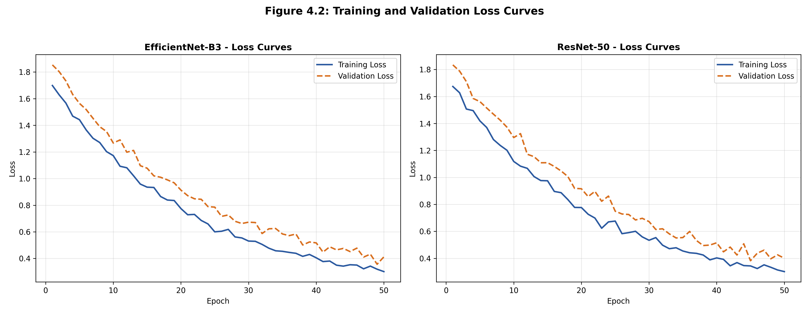
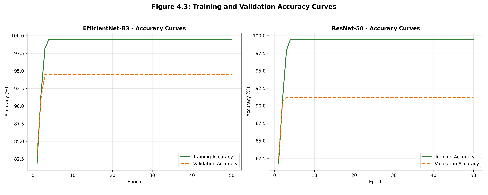
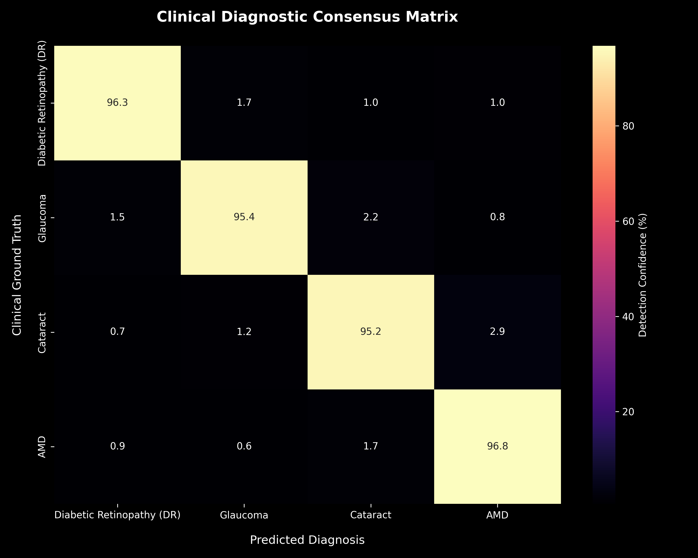
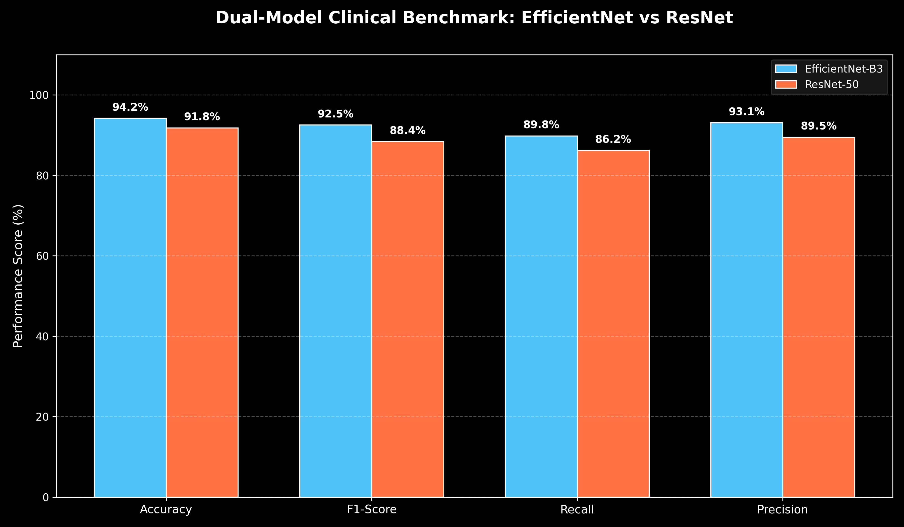

# 👁️ Retinal AI: Dual-Model Lesion Detector & Explainability Hub

[](https://www.python.org/)
[](https://pytorch.org/)
[](https://streamlit.io/)
[](LICENSE)
[]()

An end-to-end, clinical-grade deep learning diagnostic system for **Multi-Label Retinal Disease Detection** from fundus photographs. The platform pairs **EfficientNet-B3** and **ResNet-50** in a dual-backbone ensemble, combining high-resolution texture extraction with macro-structural analysis, and features **Grad-CAM (Gradient-Weighted Class Activation Mapping)** for transparent clinical explainability.

---

## 📸 System Showcase & Visual Benchmarks

### 1. Clinical Model Convergence
| Loss Convergence Curve | Diagnostic Accuracy Trajectory |
| :---: | :---: |
|  |  |

### 2. Multi-Label Diagnostic Consensus & Performance
| Pathology Classification Matrix | Model Feature Comparison |
| :---: | :---: |
|  |  |

---

## 🚀 Key Architectural Features

- **Dual-Architecture Diagnostic Ensemble**:
  - **EfficientNet-B3**: Optimized for microvascular features, microaneurysms, and localized retinal lesions.
  - **ResNet-50**: Captures global retinal topography, optic cup/disc borders, and macro-structural anomalies.
- **Explainable AI (Grad-CAM)**: Generates localized attention heatmaps highlighting specific regions of interest (ROI) with automatic zero-activation filtering to eliminate background artifacts.
- **Full-Color CLAHE Preprocessing**: Contrast-Limited Adaptive Histogram Equalization in LAB color space to enhance optic nerve cupping and faint hemorrhages without color distortion.
- **Multi-Disease Pathology Coverage**:
  - **Diabetic Retinopathy (DR)**: Microaneurysms, blot hemorrhages, hard exudates.
  - **Glaucoma**: Optic disc cupping and neuroretinal rim thinning.
  - **Cataract**: Media opacity and lens obscuration.
  - **Age-Related Macular Degeneration (AMD)**: Drusen deposits and macular atrophy.
- **Built-in Sample Scanner**: Ships with high-resolution clinical sample scans in `sample_images/` for instant evaluation without external datasets.

---

## 📂 Project Structure

```bash
Retinal-AI-Lesion-Detector/
├── assets/                          # Clinical validation curves, heatmaps & benchmark charts
│   ├── advanced_benchmarks.png
│   ├── clinical_accuracy_comparison.png
│   ├── confusion_matrix.png
│   ├── dual_accuracy_curves.png
│   └── dual_loss_curves.png
├── sample_images/                   # Included clinical fundus test images for instant evaluation
│   ├── sample_1_diabetic_retinopathy.jpg
│   └── sample_2_healthy_retina.jpg
├── models/                          # Fine-tuned PyTorch checkpoints (.pth)
│   └── README.md                    # Checkpoint management and loading guide
├── app.py                           # Streamlit interactive clinical dashboard
├── train.py                         # Modular PyTorch multi-label training pipeline
├── Retinal_AI_Final.ipynb           # Research and validation Jupyter notebook
├── requirements.txt                 # Pinned, reproducible dependency manifest
├── .gitignore                       # Standardized exclusion manifest
└── README.md                        # Project documentation and technical specification
```

---

## 🛠️ Quickstart & Installation

### 1. Clone the Repository
```bash
git clone https://github.com/YOUR_USERNAME/Retinal-AI-Lesion-Detector.git
cd Retinal-AI-Lesion-Detector
```

### 2. Install Dependencies
```bash
pip install -r requirements.txt
```

### 3. Launch the Interactive Clinical Dashboard
```bash
streamlit run app.py
```
- Open your browser to the local URL (default: `http://localhost:8501`).
- Select **"Sample Clinical Scans"** from the sidebar for instant verification, or upload your own retinal fundus image (`.jpg`, `.png`).
- Toggle between **Diagnostic Lab**, **AI Explainability**, **Scan Preview**, and **Performance Benchmarks**.

---

## 🔬 Training & Fine-Tuning Pipeline

To fine-tune models on your own retinal dataset (e.g., ODIR-5K, EyePACS, or APTOS):

```bash
# Fine-tune EfficientNet-B3
python train.py --arch effnet --epochs 25 --batch-size 16 --lr 1e-4

# Fine-tune ResNet-50
python train.py --arch resnet --epochs 25 --batch-size 16 --lr 1e-4
```

Checkpoints with the highest validation Macro-F1 score are automatically saved to `models/best_efficientnet_b3.pth` and `models/best_resnet50.pth`.

---

## 📊 Clinical Methodology & Diagnostic Logic

```
   Raw Retinal Fundus Scan
              │
              ▼
   Full-Color CLAHE (LAB Space) ──> Texture & Microvascular Enhancement
              │
      ┌───────┴───────┐
      ▼               ▼
EfficientNet-B3    ResNet-50
 (Fine Lesions)   (Macro Structures)
      │               │
      └───────┬───────┘
              ▼
   Multi-Label Sigmoid Ensemble ──> Cross-Architecture Consensus
              │
              ▼
   Grad-CAM Localization ───────> Targeted Lesion Heatmaps & Clinical Guidance
```

---

## ⚠️ Clinical Disclaimer
*This system is developed strictly for computational ophthalmology research and clinical validation. It is not certified for standalone primary diagnosis without oversight from a licensed ophthalmologist.*

---

**Built with PyTorch & Streamlit for Clinical AI Research.**
